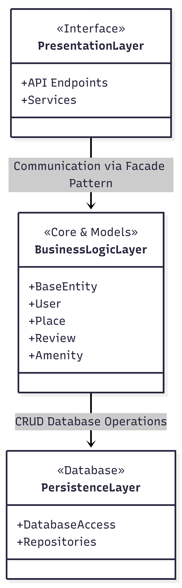
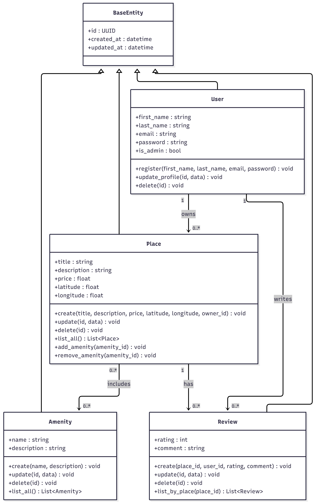

# HBnB Evolution - Technical Documentation

## Table of Contents

1. Introduction
2. High-Level Architecture
3. Business Logic Layer
4. API Interaction Flow
5. Conclusion

---

# 1. Introduction

## Purpose

> Write a brief explanation of the purpose of this document.

## Project Overview

> Briefly describe the HBnB Evolution application and its objectives.

## Scope

> Explain what this document covers.

---

# 2. High-Level Architecture

## Overview

This project is built upon a layered architecture to enforce a strict **separation of concerns**. By dividing the application into distinct, interconnected layers, the system becomes more scalable, easier to test, and simpler to maintain over time.

### Package Diagram

### Presentation Layer

> This layer serves as the entry point for user interaction. It is strictly responsible for handling user interfaces, capturing inputs, and formatting the data presented back to the client. It ensures the UI remains completely decoupled from core system operations.

### Business Logic Layer

> Serving as the core of the application, this layer contains all domain rules, calculations, and operational workflows. It processes requests originating from the Presentation layer and dictates how data should be validated and transformed.

### Persistence Layer

> This layer manages all data storage, retrieval, and database interactions. It abstracts the underlying database technologies, ensuring the Business Logic layer can save or request data without needing to know the specific details of the database implementation.

### Facade Pattern

> To streamline communication within this architecture, the **Facade Pattern** is implemented. 
*   **Why it is used:** It provides a simplified, unified interface to the complex subsystems hidden within the Business Logic layer. 
*   **How it connects the layers:** Instead of the Presentation layer interacting directly with multiple different business classes, it communicates solely through the Facade. This significantly reduces system coupling, minimizes dependencies, and protects the outer layers from being affected by internal code changes.
---

# 3. Business Logic Layer

## Overview

The following class diagram illustrates the structure of the Business Logic Layer. It shows the main entities of the HBnB application, their attributes, methods, and the relationships between them.

## Class Diagram

---

## BaseEntity

### Role

The BaseEntity class contains the common attributes shared by all other classes. Therefore, all entities inherit from BaseEntity.

### Attributes

- `id`
- `created_at`
- `updated_at`

---

## User

### Role

The User class represents a registered user in the system. A user can register, update their profile, and delete their account. A user can also own places and write reviews.

### Attributes

- `first_name`
- `last_name`
- `email`
- `password`
- `is_admin`

### Methods

- `register(first_name, last_name, email, password) : void`
- `update_profile(id, data) : void`
- `delete(id) : void`

---

## Place

### Role

The Place class stores information about a property listed by a user. Each place belongs to one owner and can have multiple amenities and reviews.

### Attributes

- `title`
- `description`
- `price`
- `latitude`
- `longitude`

### Methods

- `create(title, description, price, latitude, longitude, owner_id) : void`
- `update(id, data) : void`
- `delete(id) : void`
- `list_all() : List`
- `add_amenity(amenity_id) : void`
- `remove_amenity(amenity_id) : void`

---

## Review

### Role

The Review class represents feedback written by a user for a specific place. Each review belongs to one user and one place.

### Attributes

- `rating`
- `comment`

### Methods

- `create(place_id, user_id, rating, comment) : void`
- `update(id, data) : void`
- `delete(id) : void`
- `list_by_place(place_id) : List`

---

## Amenity

### Role

The Amenity class represents the amenities that can be associated with a place.

### Attributes

- `name`
- `description`

### Methods

- `create(name, description) : void`
- `update(id, data) : void`
- `delete(id) : void`
- `list_all() : List`

---

# Relationships

## BaseEntity → Entities

All entities inherit from BaseEntity, allowing them to share the common attributes `id`, `created_at`, and `updated_at`.

---

## User → Place

A user can own multiple places, while each place has exactly one owner.

---

## User → Review

A user can write multiple reviews, and each review is written by one user.

---

## Place → Review

A place can have multiple reviews written by different users.

---

## Place ↔ Amenity

A place can have multiple amenities, and the same amenity can be associated with multiple places. This represents a many-to-many relationship.

---

# 4. API Interaction Flow

## Overview

> Briefly explain what the sequence diagrams represent.

---

## User Registration

[](https://mermaid.live/view#pako:eNp9U8Fu2zAM_RWBl22AE8RJXCc6BNhaDAiwDkWL7jD4wtmMK8CWPEkO1gX591FOnMVNNl0smu-RjxS5g9wUBBIc_WxJ53SnsLRYZzbTgg_m3ljx7Mj2fxq0XuWqQe3Fx4f1td-fWqc0OffFlCq_BrhDjz_QUfD1_sqYRjxrr6rOLb5hpYreGU4QMVqtOKcUj1Qq5y16ZTQbLN35cyyDGDrQIQ8R0ZNAXYgHa3J2XSOf37E6qBVfjb-UFM4gyagXuNbbAO64bxlBHONCPVLcMxVLEhms_TsnNKfZHnUWkWgq4jYJb18Flqh0BufBSJ_UHK-9ORS1WvUNl-IJtzRQdaX_ATOos6ePLpvaxfuMqhoy_i3gkUI1FzLOaum__8l6a_RG2boLc73mv5PiWxtmxDVGuxN48AZvpumAFO-f2jyMyAeIoLSqAOltSxHUZGsMJuxCrAz8C9WUgeRrQRtsK8_PpPdM42H_bkzdM61pyxeQG6wcW20THvm4bycI94HsrWm1Bxkniy4GyB38AjlNJ-PZzewmSdPZfB4vkiSCV5DJYpywNZkt59MkWcb7CH53SSfjNI2niziepstkPkmXEVCheJ_vDyvfbf7-DyJQR1E)

### Description 

> Explain the flow.

---

## Place Creation

[](https://mermaid.live/view#pako:eNp9VE1v2zAM_SuCLtuAJLAbO6l9CLClGBBgHYIW7WHwhbUZV4AteZIcrAvy30c5VmAvaXXRB_nIx0dJB56rAnnKDf5uUeZ4J6DUUGc6k4wG5FZp9mRQ-5MGtBW5aEBa9nW7uXb8rTVCojE_VCnyaw53YOEFDDqbt1dKNexJWlF1ZvYMlSi80Q1HYrpaUc6UPbYvtbBsW0GObK0RrFCSPbgajB2CyJswI0LpKTRYZCALttUqJ5MHn5IPQwzXUPUOP5W9ZOjGKNXU893IvXPusP8jHEXyc-Wl7J6gUCLL-MZ-MkxSmn3PtpiwpkJSjVn9xqAEITM-DIbyzKZf-u2Y1Grl9SchYY-9jBu5U7rulPS4K71xgFHRPtb0Uucu-HcQ1RjxPpsHdKV1sKFSg8L8_EHWtZI7oesuzHUBfFcoXavdtTGNkubsPGrIxRU7-bLPj23u7s0XPuGlFgVPrW5xwmskDd2WH1y0jNtXrDHjKS0L3EFbWeqaPBKMnsIvpWqP1KotX3m6g8rQrm1cz_vXeHYhJVCvVSstT-fRsovB0wP_w9PFcpbcBEEQxYvoNl6Q7Y0Ok1l8E8fBMo6SeRTOw-OE_-1yhrNgESaLJLoNw2WUhPGEYyHosd-f_oPuWzj-A-2mUPk)

### Description

> Explain the flow.

---

## Review Submission

[](https://mermaid.live/view#pako:eNp9VMFu2zAM_RWBl22AEyROUjs6BNhaDAiwDkWL9jD4otqMK8CWPEnO1gX591GOldlrNl4kio_kIynpALkuEDhY_N6iyvFGitKIOjOZYiQid9qwR4smnDTCOJnLRijHPt5tLx1_aq1UaO0XXcr8EuBGOPEsLHpbsFdaN-xROVl1ZvYkKlkEoxdPYrLZUE7OHtrnWjp2j3uJP2gh7tYNwYQi7IgIP4UUDplQBbszOidTcD4lHYYY7kXVA75q95aZl1GqSeC5VXsP7nz_9vAUCefL4uyWXEWJLIOte2eZojT7nm0RsaZC6hZz5pWJUkiVwTAYqjObfhvUManNJvSdGij2GNo3JHdhGh46KjdEmbztcBf2s5DV2OPfPO7RF9W5DWkMSgrrf7Jea7WTpu7CXC49zIPStUbRYhut7Bk8GkXfle6KWSv1Hzh7_9Dm_tJ8gAhKIwvgzrQYQY2mFl6Fgw-YgXvBGjPgtC1wJ9rK0cjUkdzo_n_Tug6eRrflC_CdqCxpbeMH3j_BM4SageZat8oBj-NVFwP4AX6SupzOF0k8T-brZJGmiwhegafLaZyuk1l8labpfDlbHSP41eWcTZMFAUmuVut4Gc_iCLCQ9MRvT79A9xkcfwNI6U1l)

### Description

> Explain the flow.

---

## Fetch Places

[](https://mermaid.live/view#pako:eNp9VFFv2yAQ_iuIl3WSE8VOqBseIm2LKkVqpqpS-zD5hdoXB4mAB7haFuW_73BCZq9ZecDgu--77-6AAy1NBZRTBz9b0CUspait2BW20ASHKL2x5NmBjX8aYb0sZSO0J18eV9d-f22d1ODcg6llec1hKbx4FQ6CLdqVMQ151l6qzkxehJJVNIYRRIwWC4zJyVNQ6zx5kDiZDXlUogRHbjZSebCOI1spvDQ6IY2VJSQEfDn-3KdDHmQbSOWnoMIDEbpCpEFSdwnWyepT9NdCnR2-G_9eexiDUKOYyUq_BecO-y8iSES_kDgna4SKGkhBV_6TIxrDvJ3VVpilAqwn8XZPRC2kLmifDPRFzXkZt0NRi0XsDCf3WLEtWQucpa7PFY6wK03r_GGQdSQbvS_0if1eSDWE_F_PE4TkPlTVSzN-P5CAhK3V8eiEk3S9KH_PXN-_369Bn5bSNWpP1PBk0oTWVlaUe9tCQndgdyJs6SFQFNRvYQcF5bisYCNa5bGD-ogwvDA_jNlFpDVtvaV8I5TDXduE_p_v7MUF6wD2m2m1p5ylHQXlB_qL8oyx8V02Y1nKpinLU5bQPeWz6TjN5rfzjOX5hGX57JjQ313MyTi_m2WTHM1TdstYOk8oVBLfhPXp2ehej-Mf-Mtdgw)

### Description

> Explain the flow.

---

# 5. Conclusion

> Summarize the overall architecture and explain how this document will support the implementation of the HBnB application.

