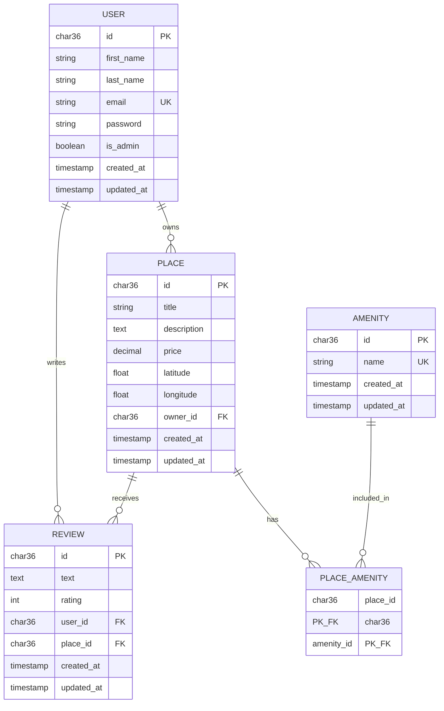
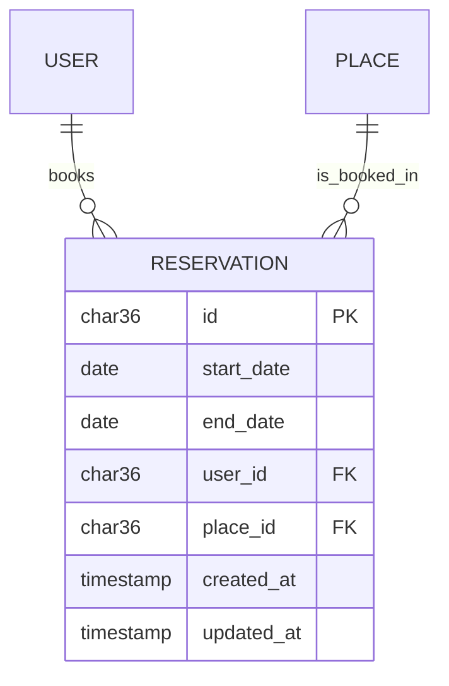

# HBnB - Database ER Diagram (Task 10)

This diagram reflects the database schema defined in `part3/sql_scripts/`
(Task 9), keeping the two tasks consistent as required.

## Relationships

| Relationship | Type | Notes |
|---|---|---|
| User → Place | One-to-many | `Place.owner_id` references `User.id`; a user can own many places |
| User → Review | One-to-many | `Review.user_id` references `User.id`; a user can write many reviews |
| Place → Review | One-to-many | `Review.place_id` references `Place.id`; a place can receive many reviews |
| Place ↔ Amenity | Many-to-many | Resolved through the `Place_Amenity` join table, whose composite primary key is `(place_id, amenity_id)` |

## Bonus - extending the model (optional exploration)

The task suggests exploring how a new `Reservation` entity might fit in.
A reservation links a `User` (who books) to a `Place` (what's booked), so it
would introduce two new one-to-many relationships without changing anything
already in the schema above:

This is exploratory only - it is not part of the Task 9 SQL schema and is not
implemented in the current database.
